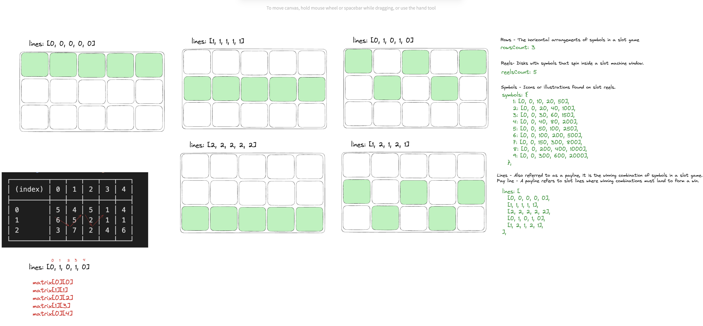
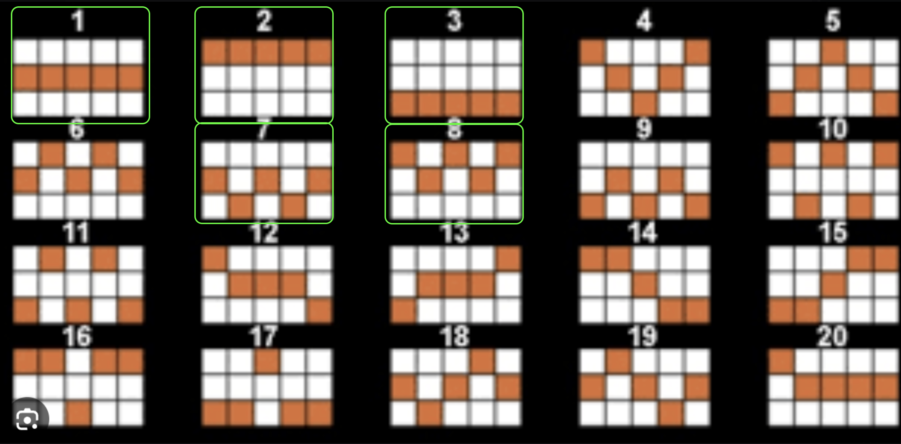

# Slot Game

## Back-End (Node.js) Project

### Requirements:

- OOP
- TypeScript

### Installation

1. Clone the repository:

```js
git clone <repository-url>
```

2. Navigate into the project directory:

```js
cd slot-game
```

3. Install dependencies:

```js
npm install
```

4. If you do not have TypeScript globally installed, you should install it, too:

```js
npm install -g typescript
// This will install the latest version (currently 5.4) globally

npm install typescript --save-dev
// This will install TypeScript in this project
```

5. Run the project

```js
cd slot-game/src
npm start
```

6. The program will execute a simulation script that iterates a large amount of spins `(1000 by default)` with information about total wins, bets `(1 by default)` and execution speed. You can change the amount of spins and bets in any time.

7. You can uncomment the code in main.ts and try a single spin
8. **Have Fun & Play Responsibly! 🙃**

### Schema:




